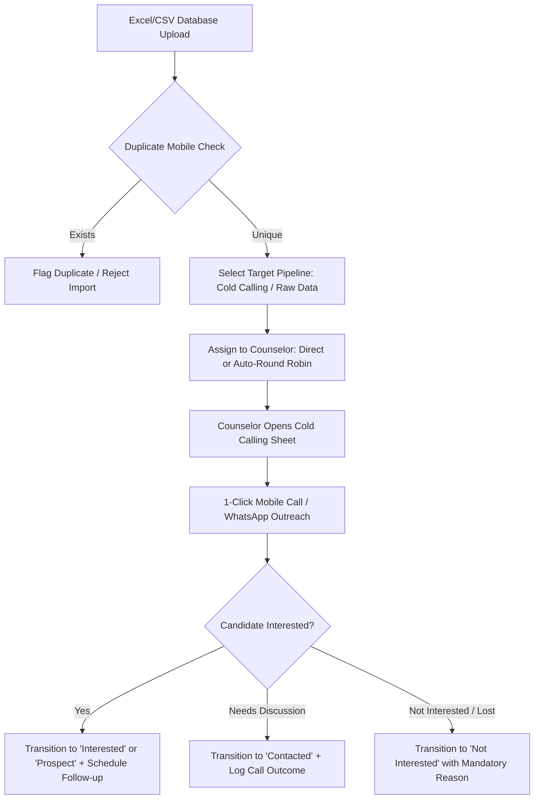
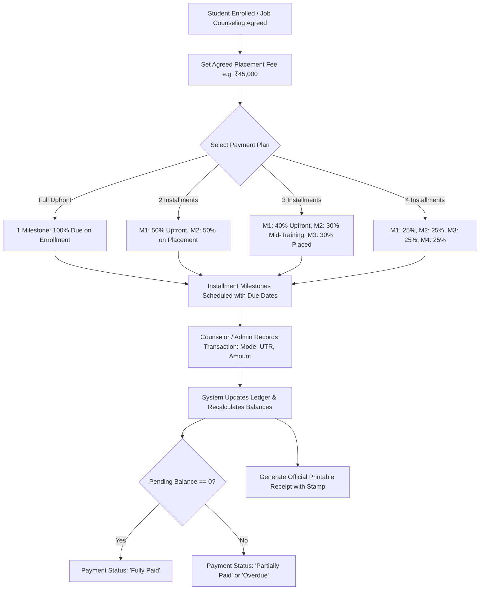
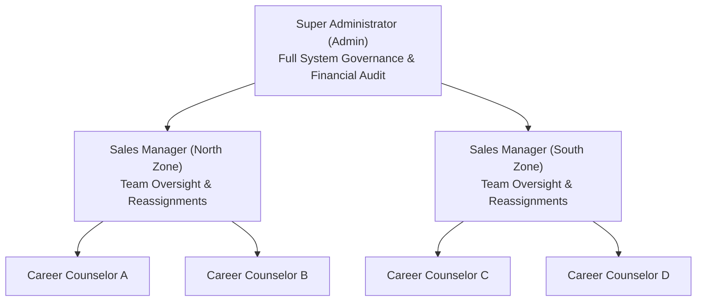
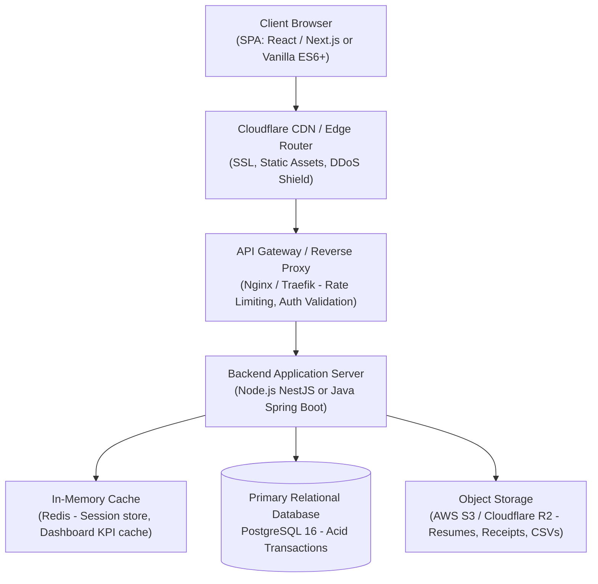
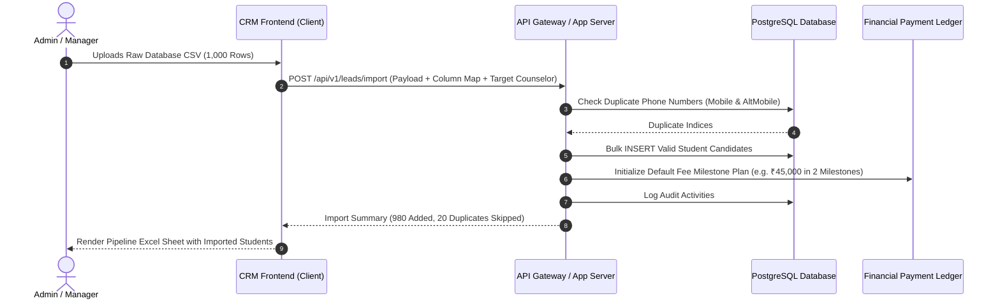
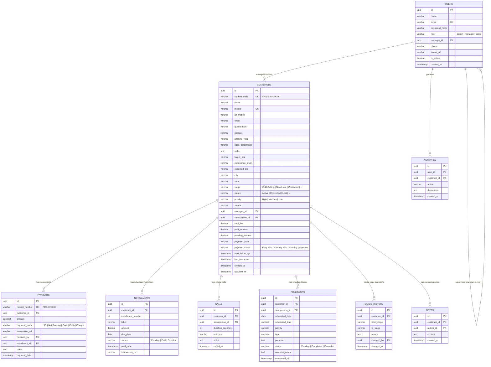
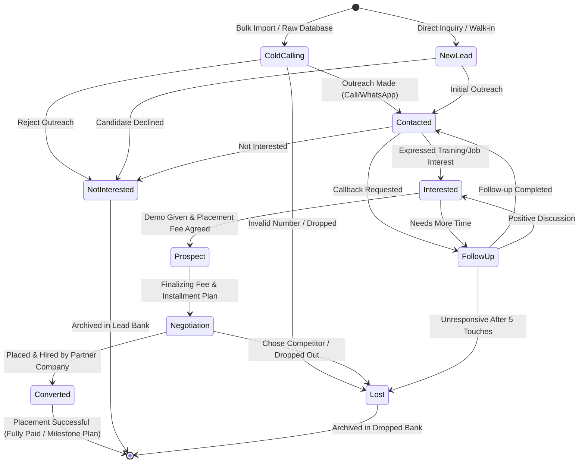

# Master Software Engineering Specification Document
## Career Apex CRM — Student Placement & Career Counseling Sales CRM

---

### Document Information
- **Project Name:** Career Apex Sales CRM (Student Career Placement & Job Counseling CRM)
- **Document Type:** Master Engineering Specification (BRS, HRD/URS, PRD, Screen-by-Screen UI/UX Spec, HLD, LLD & Tech Stack Roadmap)
- **System Version:** 2.0 (Prototype to Full-Stack Enterprise Blueprint)
- **Target Audience:** Product Owners, Technical Architects, Frontend/Backend Developers, QA Engineers, and Sales Leadership

---

## Table of Contents
1. [Executive Summary & System Vision](#1-executive-summary--system-vision)
2. [BRS — Business Requirements Specification](#2-brs--business-requirements-specification)
3. [HRD / URS — Human Roles & User Requirements Specification](#3-hrd--urs--human-roles--user-requirements-specification)
4. [PRD — Product Requirements Document](#4-prd--product-requirements-document)
5. [Screen-by-Screen Deep Dive Functional Specification](#5-screen-by-screen-deep-dive-functional-specification)
6. [HLD — High-Level Design Document](#6-hld--high-level-design-document)
7. [LLD — Low-Level Design Document](#7-lld--low-level-design-document)
8. [Production Technology Stack & Migration Roadmap](#8-production-technology-stack--migration-roadmap)

---

## 1. Executive Summary & System Vision

### 1.1 Background & Purpose
Career Apex CRM is a specialized Customer Relationship Management platform purpose-built for educational institutions, career placement agencies, and job counseling firms. Traditional B2B CRMs (Salesforce, HubSpot) are modeled around corporate "Accounts" and "Deals," which are ill-fitted for student placement operations. 

Career Apex CRM replaces the corporate account paradigm with a student-centric architecture:
- Every lead is an individual **Student Job Seeker** with academic credentials, passing years, target technical roles, and skills.
- The sales cycle tracks **Candidate Counseling**, **Skills Assessment**, **Interview Pipeline Readiness**, and **Placement Hiring**.
- The monetization model is based on **Agreed Placement Fees**, tracking upfront collections and multi-installment milestones with automated receipts and overdue balance tracking.

### 1.2 Core Business Objectives
- **Centralize Lead Inflow:** Ingest raw calling databases, campus walk-ins, college placement lists, and job portal inquiries without duplicate registrations.
- **Excel-Sheet View Productivity:** Provide counseling teams with dense, spreadsheet-style views that allow instant inline stage transitions, notes, and call logging.
- **Placement Fee Realization:** Monitor contracted placement revenue, cash collected, and installment milestones across counselors and managers.
- **End-to-End Auditability:** Record all student transitions, communication touches (Calls, WhatsApp, Emails), and counseling notes.

---

## 2. BRS — Business Requirements Specification

### 2.1 Business Goals & Success Metrics
| Business Metric | Target Objective | CRM Functional Capability |
| :--- | :--- | :--- |
| **Lead-to-Contact Velocity** | Contact 90% of raw leads within 24 hours | Cold Calling pipeline sheet, 1-click WhatsApp/Call triggers |
| **Placement Fee Realization** | Achieve >85% fee realization on placed students | Multi-installment payment ledger, automated receipt issuance, overdue flags |
| **Counselor Productivity** | 45+ candidate interactions/counselor/day | Inline call outcome modals, rapid follow-up task queue |
| **Data Hygiene** | Zero duplicate registrations across 50,000+ candidate files | Automated 10-digit mobile number uniqueness validation |
| **Executive Visibility** | Real-time realization and conversion analytics | Multi-filter intelligence reports, counselor leaderboards |

### 2.2 Operational Business Workflows

#### 2.2.1 Lead Ingestion & Cold Calling Workflow

#### 2.2.2 Placement Fee & Milestone Payment Workflow

---

## 3. HRD / URS — Human Roles & User Requirements Specification

### 3.1 Organizational Role Hierarchy

### 3.2 Role Permissions Matrix
| Functional Feature | Super Administrator | Sales Manager | Career Counselor (Sales Rep) |
| :--- | :---: | :---: | :---: |
| **View Dashboard** | Global Organization Dashboard | Assigned Team Dashboard | Personal Workspace Dashboard |
| **Student Directory Visibility** | All Registered Students | Students under reporting team | Assigned Students Only |
| **Pipeline View (Excel Sheet)** | All Students across all stages | Team Students across all stages | My Students across all stages |
| **Bulk CSV/Excel Lead Import** | Full Import + Counselor Allocation | Full Import + Team Counselor Allocation | View-only / Restricted |
| **Reassign Student Counselor** | Yes (Any counselor/manager) | Yes (Within own reporting team) | No (Request reassignment) |
| **Edit Student Profile** | All Fields (Academic + Fee) | All Fields (Academic + Fee) | Academic, Profile, Contact only |
| **Record Fee Payments** | Yes (All students) | Yes (Team students) | Yes (Assigned students) |
| **Issue Payment Receipts** | Yes | Yes | Yes |
| **Delete Student Record** | Yes (With Confirmation Dialog) | No | No |
| **Universal Reports & Analytics** | Full Organization Access | Team Performance & Revenue | View Own Performance |
| **System Settings & Demo Reset** | Full Control | No | No |

---

## 4. PRD — Product Requirements Document

### 4.1 Functional Requirements (FR)

#### FR-01: Student Candidate Record Management
- System shall store student profile without requiring company or corporate account entities.
- Fields: Student ID (`CRM-STU-XXX`), Full Name, Mobile (10 digits), Alternate Mobile/WhatsApp, Email, Qualification/Degree, College/University, Passing Year (YOP), CGPA/Percentage, Key Technical Skills, Target Job Role, Experience Level, Expected CTC, Preferred Location, Permanent Address, City, State.
- Validation: Duplicate phone check across primary and secondary numbers.

#### FR-02: Placement Fee & Payment Ledger Engine
- Custom agreed fee per student candidate.
- Payment plans: Full payment upfront, 2 installments, 3 installments, 4 installments.
- Milestone tracking: Name, Due Date, Amount, Paid Date, Status (`Pending`, `Paid`, `Overdue`).
- Payment logging: Amount, Payment Mode (`UPI`, `Net Banking`, `Credit/Debit Card`, `Cash`, `Cheque`), Transaction Reference / UTR Number, Received By Counselor, Notes.
- Dynamic balance calculation: `totalFee = paidAmount + pendingAmount`.
- Status flags: `Fully Paid`, `Partially Paid`, `Pending`, `Overdue`.
- Printable payment receipts with official voucher numbers, candidate details, counselor signatures, and organization stamp.

#### FR-03: Multi-Stage Pipeline & Excel Sheet Interface
- Stages: `Cold Calling (Raw Data)`, `New Lead`, `Contacted`, `Interested`, `Prospect`, `Follow-up`, `Negotiation`, `Converted (Placed)`, `Not Interested`, `Lost`.
- Expandable and collapsible sidebar submenus linking directly to filtered stage views.
- Dense spreadsheet table layout with sticky actions column, row index counters, and live status bar.
- Stage transition modal enforcing a mandatory transition reason and audit logging.

#### FR-04: Multi-Channel Communication Center
- **Phone Calls:** Click-to-call modal tracking call duration (seconds/minutes), outcome disposition (`Connected - Interested`, `Ringing - No Answer`, `Busy`, `Invalid Number`, `Follow-up Requested`), and notes.
- **WhatsApp:** 1-click internationalized `https://wa.me/91XXXXXXXXXX?text=...` deep-link with pre-configured counseling templates.
- **Email:** Integrated compose drawer supporting Subject, Body, and Counselor signature.

#### FR-05: Task & Follow-up Scheduling Engine
- Schedule follow-up with Date, Time, Priority (`High`, `Medium`, `Low`), and Action Type (`Phone Call`, `WhatsApp`, `Email`, `In-person Counseling`).
- Categorization into `Overdue`, `Today`, and `Upcoming`.
- 1-click completion toggle that prompts outcome notes.

#### FR-06: Universal Multi-Dimensional Reports Engine
- Filter parameters: Date Presets (`Today`, `Yesterday`, `This Week`, `This Month`, `Last 30 Days`, `This Quarter`, `Custom Range`), Counselor, Manager, Pipeline Stage, Payment Status (`Fully Paid`, `Partially Paid`, `Pending`, `Overdue`), and Lead Source.
- Tab 1: **Placement Fees & Revenue Analytics** (KPIs, Counselor Realization Leaderboard, Payment Mode Share Doughnut, Revenue by Stage Bar, Overdue Milestones Alert).
- Tab 2: **Sales Team Performance** (Assigned, Contacted, Calls, Converted, Realized Revenue, Win Rate).
- Tab 3: **Stage Movement & Velocity** (Audit transition volume from Stage A to Stage B).
- Tab 4: **Lead Source Attribution** (Inflow and conversion rate by acquisition channel).

---

## 5. Screen-by-Screen Deep Dive Functional Specification

### 5.1 Screen 1: Login & Role Selection (`index.html`)
- **Primary Use:** Authentication gate and instant role persona switcher for prototype and production testing.
- **Key UI Elements:**
  - Application branding: Career Apex CRM logo, badge, and tagline.
  - Login form: Email, Password, Remember Me toggle.
  - **1-Click Demo Personas Strip:**
    - `Admin (USR-001)`: Rajesh Sharma — Super Administrator.
    - `Manager (USR-002)`: Priya Patel — North Regional Sales Manager.
    - `Sales Rep (USR-004)`: Amit Verma — Career Counselor.
- **Validation & Flow:** Verifies credentials from `crm_users`. Sets active session into `crm_session` and redirects to the appropriate role-based dashboard.

---

### 5.2 Screen 2: Executive Admin Dashboard (`pages/admin-dashboard.html`)
- **Primary Use:** High-level executive monitoring of global student intake, placement velocity, and financial fee collections.
- **Layout & Structure:**
  1. **Top Metric Strip:** Live greeting, role badge, quick links to "Detailed Reports" and "Open Pipeline".
  2. **Placement Fee & Revenue Realization Banner:**
     - Total Booked Fees (`dash-fee-booked`) in ₹.
     - Realized Cash Collected (`dash-fee-collected`) in ₹.
     - Outstanding Dues (`dash-fee-pending`) in ₹ + Overdue Milestones badge.
     - Collection Realization Rate % with dynamic progress bar.
  3. **Operational Candidate KPIs (8 Cards):** Total Students, New Leads, Contacted, Interested, Active Prospects, Converted Placements, Lost/Dropped, Today's Follow-ups.
  4. **Analytics Charts Grid:**
     - Left: Pipeline Stage Breakdown (Chart.js Bar Chart).
     - Right: Pipeline Stage Share (Chart.js Doughnut Chart).
  5. **Operational Leaderboard & Audit:**
     - Left: Sales Team Performance Leaderboard table (Reps, Managers, Leads, Calls, Converted, Win Rate).
     - Right: Live Audit Timeline stream displaying real-time events.

---

### 5.3 Screen 3: Sales Manager Command Center (`pages/manager-dashboard.html`)
- **Primary Use:** Middle-management operational view for managing direct career counselors, team targets, and student reassignments.
- **Layout & Structure:**
  1. **Team Placement Revenue Banner:** Total Team Booked Fee, Cash Collected, Pending Dues, Team Collection Rate %.
  2. **Team Pipeline KPIs:** Team Members count, Total Assigned Students, Today's Follow-ups, Interested Leads, Active Prospects, Converted Deals.
  3. **Visuals:** Team Pipeline Distribution Chart and Direct Reporting Counselors table with 1-click Reassignment triggers.
  4. **Action Feeds:** Urgent Team Follow-ups queue and Team Activity Audit Feed.

---

### 5.4 Screen 4: Career Counselor Daily Workspace (`pages/salesperson-dashboard.html`)
- **Primary Use:** Daily operational cockpit for individual career counselors to execute phone calls, counseling sessions, follow-ups, and payment collection.
- **Layout & Structure:**
  1. **Counselor Target Banner:** Personal Booked Fees, Collected to Date, Pending Dues, Personal Realization Rate %.
  2. **Counselor KPIs:** My Assigned Leads, Today's Scheduled Follow-ups, Overdue Follow-ups, Warm Interested Candidates, Prospects, Closed Placements.
  3. **Action Queue (Today's Scheduled Tasks):** Dense task cards with 1-click **Call**, **WhatsApp**, **Email**, and **Mark Complete** buttons.
  4. **Active Portfolio Table:** Quick list of assigned students, current pipeline stage, and profile link.

---

### 5.5 Screen 5: Student Job Seekers Directory (`pages/customers.html`)
- **Primary Use:** Master searchable and filterable database of all enrolled student candidates.
- **Layout & Structure:**
  1. **Top Actions:** Export CSV, Import CSV wizard link, Register Student modal button.
  2. **Multi-Filter Ribbon:**
     - Row 1: Search Keyword (ID, Name, College, Skills, Mobile), Pipeline Stage, Status, Priority.
     - Row 2: Counselor, Passing Year (2022-2026), City, **Placement Fee Status** (`All`, `Fully Paid`, `Partially Paid`, `Pending`, `Overdue`), Rows per page, Clear Filters button.
  3. **Table Columns:**
     - Student ID (`CRM-STU-XXX`)
     - Candidate Name & Degree
     - College / University & Passing Year
     - Target Role & Technical Skills
     - Mobile Phone
     - Pipeline Stage Badge
     - **Placement Fee & Dues** (Total Fee, Paid, Due, Status Badge)
     - Placement Status Badge
     - Priority Badge
     - Counselor & Manager Name
     - Next Follow-up Date (red if overdue)
     - Quick Action Icons (View Profile, Edit Profile, Call, WhatsApp, Email, Delete).
  4. **Modals:**
     - Register Student Modal (Global).
     - **Edit Student Profile Modal:** Complete modal updating academic, personal, job preference, pipeline, and placement fee fields (`totalFee`, `paymentPlan`, `paymentStatus`).

---

### 5.6 Screen 6: Student Profile Dossier (`pages/customer-details.html`)
- **Primary Use:** The definitive single-source-of-truth dossier for an individual candidate job seeker.
- **Layout & Structure:**
  1. **Candidate Identity Hero Banner:**
     - Student Avatar with initials.
     - Name, Student ID, Primary Mobile, WhatsApp link, Email, City, Expected CTC.
     - Interactive Stage Transition dropdown with reason capture.
     - Quick Action Buttons: Call Student, Open WhatsApp, Send Email, Schedule Follow-up, Edit All Details.
  2. **Seven Dedicated Tabs:**
     - **Tab 1: Overview & Academic Profile:** Academic cards (College, Degree, CGPA, YOP), Career Preferences (Target Role, Skills, CTC, Experience), Counseling Notes, and **Placement Fee Summary Card** (Total, Paid, Due, Plan, Status).
     - **Tab 2: Activity Timeline:** Chronological event cards for every touchpoint.
     - **Tab 3: Counseling Notes:** Rich-text notes ledger with author and timestamp.
     - **Tab 4: Call Logs:** Telephony call outcome ledger (Duration, Disposition, Outcome notes).
     - **Tab 5: Scheduled Follow-ups:** Interactive task items with completion checkboxes.
     - **Tab 6: Stage History:** Audit log showing every pipeline progression, old stage, new stage, counselor, and transition reason.
     - **Tab 7: Placement Fee & Payments:**
       - 4 Financial KPI cards (Booked Fee, Collected Cash, Outstanding Balance, Payment Status Badge & Plan).
       - Realization progress bar.
       - **Scheduled Installment Milestones Table:** Milestone #, Label, Due Date, Amount, Status, and "Collect Payment" action.
       - **Payment Transaction Ledger Table:** Transaction ID, Date, Amount, Payment Mode, UTR Reference Number, Received By, and "Official Receipt" button.
  3. **Financial Modals:**
     - **Record Fee Installment Payment Modal:** Milestone selector, Amount, Payment Mode (`UPI`, `Net Banking`, `Card`, `Cash`, `Cheque`), Transaction Ref, Counselor, Notes.
     - **Official Payment Receipt Modal:** Formatted printable invoice/receipt with candidate info, voucher number, payment mode, breakdown, counselor signature line, and official print button (`window.print()`).

---

### 5.7 Screen 7: Excel Spreadsheet Pipeline View (`pages/pipeline.html`)
- **Primary Use:** High-efficiency, dense tabular interface designed to replicate Excel sheets for rapid candidate progression without Kanban board clutter.
- **Layout & Structure:**
  1. **Top Stage Pill Bar (Excel Sheets Switcher):** Horizontal pill tabs for `All Leads` and each of the 10 stages with live candidate counters.
  2. **Excel Filter Ribbon:** Search keyword, Passing Year dropdown, Priority dropdown, Counselor dropdown, **Fee Status dropdown**, and Reset button.
  3. **Spreadsheet Grid:**
     - `#` Row Index column.
     - Candidate attributes: ID, Name, Qualification, College, YOP, Skills, Target Role, Experience, Mobile, Quick Connect.
     - Stage badge with edit icon (prompts stage modal).
     - Priority, Status.
     - **Placement Fee & Due column** (Bold Fee, Due amount/Paid in full).
     - Counselor, City, Next Follow-up.
     - Sticky Actions column: View Profile, Edit Details, Reassign Lead, Add Note.
  4. **Excel Status Bar:** Ready indicator, visible row count, active stage label, total enrolled candidates, overall placement conversion win rate %.

---

### 5.8 Screen 8: Bulk Lead Import Engine (`pages/import-leads.html`)
- **Primary Use:** Mass onboarding of candidate raw databases from Excel (.xlsx, .xls) and CSV spreadsheets.
- **Layout & Structure:**
  - **Step 1: Configuration & Upload:**
    - Drag-and-drop file upload zone.
    - **Target Pipeline Stage Selector:** Choose `Cold Calling (Raw Data)`, `New Lead`, etc.
    - **Target Counselor Assignment:** Auto Round-Robin or Direct assignment to a selected counselor.
  - **Step 2: Intelligent Column Mapping:**
    - Interactive mapping interface matching uploaded sheet headers to CRM candidate attributes (Student Name, Mobile, Email, Degree, College, Passing Year, Skills, Target Role, City, Fee).
  - **Step 3: Validation, Deduplication & Preview:**
    - Real-time row parser flagging invalid mobile numbers and checking against existing CRM phone numbers.
    - Row status tags: `Valid (Ready to Import)`, `Duplicate Phone (Will Skip)`, `Invalid Mobile`.
  - **Commit Action:** Ingests clean rows, creates candidate profiles, seeds fee plans, records audit activity, and redirects to pipeline view.

---

### 5.9 Screen 9: Follow-up & Task Management (`pages/followups.html`)
- **Primary Use:** Daily agenda and calendar task planner for candidate follow-ups.
- **Layout & Structure:**
  - Top Summary Cards: Today's Due, Overdue Tasks, Upcoming Tasks, Completed to Date.
  - Filter Bar: Date filters, priority filters, counselor filters.
  - Task Lists categorized into **Overdue** (red accent), **Today** (amber accent), and **Upcoming** (slate accent).
  - Direct action triggers on each item: Call, WhatsApp, Email, and Complete.

---

### 5.10 Screen 10: Multi-Channel Communication Center (`pages/communication.html`)
- **Primary Use:** Dedicated telephony, WhatsApp, and email dispatch dashboard.
- **Layout & Structure:**
  - Telephony dialer widget and call log history table.
  - WhatsApp chat initiator with customizable template library (e.g. Welcome Message, Interview Slot Confirmation, Placement Fee Reminder, Document Submission).
  - Email log history and email template manager.

---

### 5.11 Screen 11: Real-time Activity & Audit Trail (`pages/activities.html`)
- **Primary Use:** Immutable compliance and governance audit log tracking every interaction and system event.
- **Layout & Structure:**
  - Search and filter bar (by User, Action Type, Customer ID, Date).
  - Chronological activity feed showing timestamp, user avatar, action badge (`Student Registered`, `Stage Transition`, `Payment Recorded`, `Follow-up Completed`, `Call Logged`), and detailed event description.

---

### 5.12 Screen 12: Sales Team & Counselor Hierarchy (`pages/team.html`)
- **Primary Use:** Counselor roster, manager hierarchy mapping, and team productivity scorecards.
- **Layout & Structure:**
  - Add Counselor / Manager Modal.
  - Team member cards showing avatar, role, reporting manager, assigned candidates, converted students, and win rate.
  - Performance leaderboard comparing counselors against monthly targets.

---

### 5.13 Screen 13: Sales Intelligence & Placement Reports (`pages/reports.html`)
- **Primary Use:** Executive and managerial multi-dimensional reporting across revenue, counselor velocity, and lead attribution.
- **Layout & Structure:**
  1. **Universal Multi-Dimensional Filter Toolbar:**
     - Date Preset (`All Time`, `Today`, `Yesterday`, `This Week`, `This Month`, `Last 30 Days`, `This Quarter`, `Custom Range`).
     - Start Date & End Date pickers.
     - Career Counselor filter.
     - Sales Manager filter.
     - Pipeline Stage filter.
     - **Fee / Payment Status filter** (`All`, `Fully Paid`, `Partially Paid`, `Pending`, `Overdue`).
     - Lead Source filter.
     - Apply & Reset buttons + Export Active Report CSV button.
  2. **Four Tabbed Reports:**
     - **Tab 1: Placement Fees & Revenue Analytics:** 4 KPI Cards (Booked Fee, Collected Cash, Pending Dues, Collection Rate %), Counselor Realization Leaderboard Table, Payment Methods Doughnut Chart, Revenue by Stage Bar Chart, Overdue & Pending Installment Milestones Alert Table with direct Collect button.
     - **Tab 2: Counselor Performance:** Comparison Bar Chart (Assigned vs Converted) and detailed table with calls, follow-ups, win rate, and booked vs collected fees.
     - **Tab 3: Stage Movement & Velocity:** Transition breakdown table (From Stage -> To Stage) and velocity volume bar chart.
     - **Tab 4: Lead Source Attribution:** Doughnut chart of acquisition sources and channel conversion efficiency table.

---

### 5.14 Screen 14: System Settings & Demo Configuration (`pages/settings.html`)
- **Primary Use:** System preferences, demo data re-seeding, and local cache management.
- **Layout & Structure:**
  - CRM Profile & Branding settings.
  - Placement Fee default parameters (Standard fee amount, default installment split).
  - Storage statistics (Local storage usage in bytes, records count).
  - **Reset Demo Data Action:** Re-seeds 20+ realistic student profiles, payment ledgers, call logs, and activities.

---

## 6. HLD — High-Level Design Document

### 6.1 Architectural System Topology (Production Target)

### 6.2 Data Flow Architecture: Lead Ingestion to Revenue Realization

---

## 7. LLD — Low-Level Design Document

### 7.1 Relational Database Entity-Relationship (ERD) Schema

### 7.2 Candidate Pipeline State Machine

### 7.3 RESTful API Endpoints Specification

| Method | Endpoint | Description | Access Role |
| :--- | :--- | :--- | :--- |
| `POST` | `/api/v1/auth/login` | Authenticate user & issue JWT | Public |
| `GET` | `/api/v1/auth/me` | Fetch authenticated user profile & permissions | All |
| `GET` | `/api/v1/students` | List student directory with multi-filters & pagination | All (Scoped) |
| `POST` | `/api/v1/students` | Register a new student candidate | All |
| `GET` | `/api/v1/students/:id` | Get comprehensive student profile dossier | All (Scoped) |
| `PUT` | `/api/v1/students/:id` | Update student profile, academic & fee parameters | Admin, Manager, Assigned Rep |
| `DELETE` | `/api/v1/students/:id` | Delete student candidate record | Admin Only |
| `POST` | `/api/v1/students/:id/stage` | Transition stage with mandatory reason | All (Scoped) |
| `POST` | `/api/v1/students/import` | Bulk upload Excel/CSV with mapping and deduplication | Admin, Manager |
| `POST` | `/api/v1/payments` | Record placement fee installment payment | All (Scoped) |
| `GET` | `/api/v1/payments/receipt/:id` | Fetch official printable receipt payload | All |
| `GET` | `/api/v1/reports/revenue` | Get placement revenue, realization rate & leaderboard | Admin, Manager |
| `GET` | `/api/v1/reports/team` | Get counselor performance and win rates | Admin, Manager |
| `GET` | `/api/v1/reports/stage-velocity`| Get stage transition movement counts | Admin, Manager |
| `GET` | `/api/v1/reports/sources` | Get acquisition channel conversion attribution | Admin, Manager |

---

## 8. Production Technology Stack & Migration Roadmap

### 8.1 Recommended Production Stack

```mermaid
graph LR
    subgraph Frontend [Modern Frontend Layer]
        FE1[Next.js 14 / React 18 App Router]
        FE2[TypeScript + Tailwind CSS / Vanilla Design System]
        FE3[TanStack Table for Virtualized Excel View]
        FE4[Chart.js / Recharts for Visual Analytics]
    end

    subgraph Backend [High-Performance API Layer]
        BE1[Node.js with NestJS Framework or Go Gin]
        BE2[Prisma ORM or TypeORM]
        BE3[JWT Authentication + RBAC Middleware]
        BE4[BullMQ + Redis for Async Bulk Ingestion]
    end

    subgraph Database [Storage & Persistence Layer]
        DB1[(PostgreSQL 16 Relational Engine)]
        DB2[(Redis 7 In-Memory Cache)]
        DB3[AWS S3 / MinIO for Resumes & Receipts]
    end

    Frontend --> Backend --> Database
```

### 8.2 Migration Phase Roadmap (Prototype to Production)

| Phase | Duration | Scope & Milestones |
| :--- | :---: | :--- |
| **Phase 1: Database & Backend Core** | 3 Weeks | Provision PostgreSQL schema, setup NestJS REST API, migrate seed data from `crm_seed_data` to SQL migrations, implement JWT auth and RBAC guards. |
| **Phase 2: API Integration with Frontend** | 2 Weeks | Replace `js/storage.js` calls with an `api-client.js` Axios/Fetch wrapper pointing to REST endpoints; maintain existing HTML/CSS UI with zero visual disruption. |
| **Phase 3: High-Scale Bulk Import & Processing** | 2 Weeks | Build asynchronous worker queue (BullMQ + Redis) for importing 50,000+ candidate rows with background phone deduplication and email notification on completion. |
| **Phase 4: Production Notification Engine** | 2 Weeks | Integrate automated notifications (deferred as noted): WhatsApp Cloud API (Meta), SMS Gateway (Twilio/Gupshup) for fee reminders, and browser push alerts for follow-up reminders. |
| **Phase 5: Telephony & Cloud PBX Integration** | 2 Weeks | Integrate cloud telephony (Exotel / Knowlarity / Twilio) for true browser-based calling with auto-recording and automated duration capture. |
| **Phase 6: QA, Penetration Testing & Deployment** | 1 Week | Docker containerization, CI/CD pipeline (GitHub Actions), Nginx reverse proxy, SSL, and load testing up to 10,000 concurrent counselors. |

---

*Document compiled and verified against the working Career Apex CRM codebase.*
