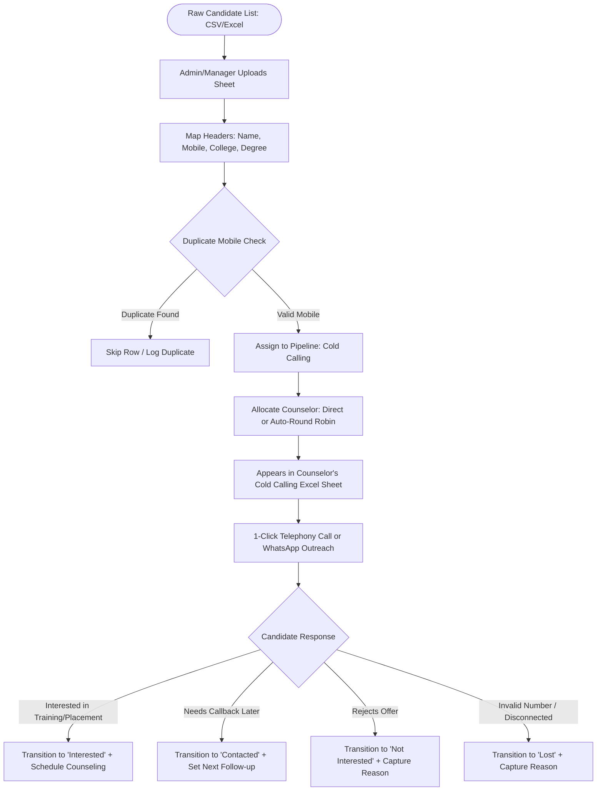
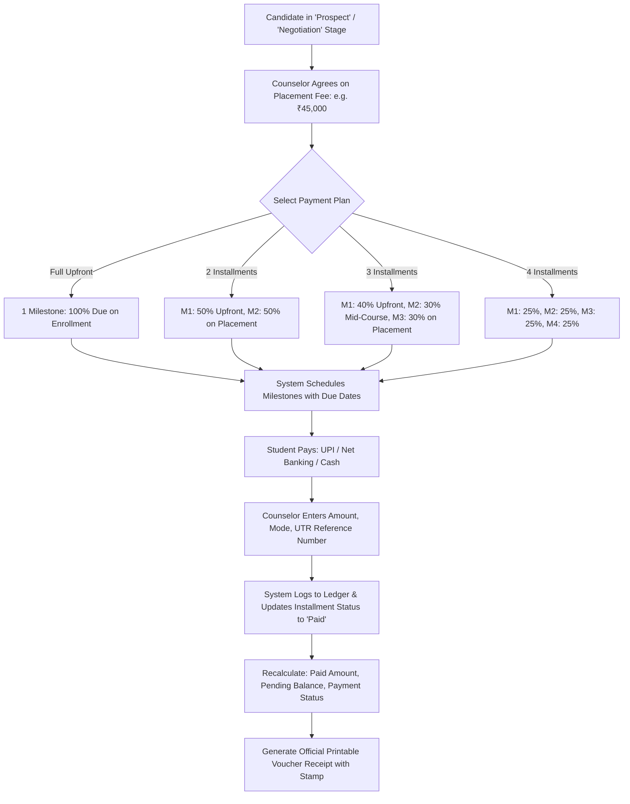

# Business Requirements Specification (BRS)
## Career Apex CRM — Student Placement & Career Counseling Sales CRM

---

### Document Control
- **Document Identifier:** BRS-APEX-01
- **Version:** 2.0
- **Status:** Approved
- **Domain:** Student Career Placement, EdTech Sales, Job Counseling Agency

---

## 1. Business Context & Problem Statement

### 1.1 Industry Background
Educational placement institutes, job training academies, and staffing/career counseling consultancies operate with a unique operational model:
1. They source thousands of aspiring student job seekers across engineering colleges, universities, and polytechnics.
2. They guide them through career counseling, technical skills assessment, and corporate interview readiness.
3. They connect qualified students with corporate recruiters and place them into technical, operational, and professional roles.
4. **Monetization Model:** Candidates agree to pay a **Placement Service Fee** (ranging from ₹30,000 to ₹70,000) either upfront upon registration or in structured milestones (e.g., training milestone, interview clearance milestone, joining/placement milestone).

### 1.2 Critical Flaws in Traditional B2B CRMs
Traditional CRMs such as Salesforce, HubSpot, or Zoho are built around corporate B2B transactions:
- **Corporate Account Anchor:** Every contact must belong to an "Account" or "Company." For student recruitment, students are independent job seekers and have no company account.
- **Deal-Centric Pipelines:** Standard deals track vendor procurement stages instead of student educational qualifications, passing years (YOP), skills, and interview readiness.
- **Payment Inflexibility:** Traditional CRMs do not natively track student installment milestones, UTR references, receipts, and overdue collections against candidates.
- **Sub-optimal Tabular Views:** Counselors handling hundreds of cold calls daily need spreadsheet-speed data entry, not complex drag-and-drop Kanban boards.

### 1.3 Proposed Business Solution
Career Apex CRM is engineered specifically for candidate placement counseling:
- **Student Candidate as First-Class Entity:** Comprehensive capture of degree, college, passing year (2022–2026), skills, target roles, and location preferences.
- **Excel Spreadsheet-Style Interface:** Enables counselors to review and progress hundreds of leads daily with instant inline calling, WhatsApp, and status updates.
- **Native Placement Fee Management:** Configurable milestone fee plans (Upfront, 2, 3, or 4 installments) with payment recording, transaction references, balance calculation, and receipt issuance.
- **Multi-Level Intelligence:** Real-time visibility into counselor conversion rates, fee realization, and acquisition channel efficiency.

---

## 2. Business Objectives & ROI Metrics

| Strategic Objective | Baseline Metric | Target Metric | CRM Enabling Capability |
| :--- | :--- | :--- | :--- |
| **Lead Outreach Speed** | 48–72 hours post-inquiry | < 4 hours (90% within 24h) | Cold Calling pipeline sheet, 1-click WhatsApp & Call integration |
| **Placement Fee Realization** | 62% of booked fees collected | > 88% realization | Installment schedule tracking, overdue alerts, payment receipt generation |
| **Counselor Productivity** | ~20 interactions/day | 45+ candidate touches/day | Dense Excel view, inline call outcome logging, rapid follow-up scheduler |
| **Lead Ingestion Efficiency** | 2 days manual data entry | < 3 minutes bulk upload | SheetJS Excel/CSV import wizard with duplicate phone detection |
| **Drop-off Auditability** | Unknown lost reasons | 100% audited stage changes | Mandatory transition reason logging on every stage change |

---

## 3. Business Scope

### 3.1 In-Scope Capabilities
1. **Candidate Onboarding:** Individual registration and mass Excel/CSV spreadsheet upload.
2. **Contact Deduplication:** Strict phone number uniqueness validation across primary and alternate mobile numbers.
3. **Pipeline Staging:** 10 sequential placement stages:
   - *Cold Calling (Raw Data)* $\rightarrow$ *New Lead* $\rightarrow$ *Contacted* $\rightarrow$ *Interested* $\rightarrow$ *Prospect* $\rightarrow$ *Follow-up* $\rightarrow$ *Negotiation* $\rightarrow$ *Converted (Placed)* $\rightarrow$ *Not Interested* $\rightarrow$ *Lost*.
4. **Placement Fee Engine:** Custom fee assignment, installment generation, transaction logging (UPI, Net Banking, Card, Cash, Cheque), real-time balance computation, and printable receipt generation.
5. **Counseling Touchpoints:** Telephony call outcome logging, WhatsApp templated messaging, email communication.
6. **Task Execution:** Scheduled follow-ups categorized into Overdue, Today, and Upcoming.
7. **Role Governance:** Strict role segregation for Super Administrator, Sales Manager, and Career Counselor.
8. **Universal Reporting:** Multi-dimensional filtering across dates, counselors, managers, stages, and fee statuses.

### 3.2 Out-of-Scope (Deferred to Future Releases)
- Automated SMS gateway integration (e.g. Twilio/Gupshup) — scheduled for Phase 4.
- Automated WhatsApp Cloud API bot dispatch — scheduled for Phase 4.
- Direct Cloud PBX VoIP dialing (currently opens system tel: protocol) — scheduled for Phase 5.
- Online payment gateway integration (Razorpay/Stripe checkout links) — cash/manual bank transfer tracking supported in current scope.

---

## 4. Business Actors & Stakeholders

| Stakeholder Role | Business Responsibility | Primary System Interest |
| :--- | :--- | :--- |
| **Super Administrator (Executive)** | Company director, operations head, or CEO. Overall business health, revenue targets, and compliance. | Executive dashboards, booked vs collected placement revenue, organization-wide conversion rates. |
| **Sales / Center Manager** | Team leader managing 5–15 career counselors. Lead allocation, quota tracking, and team coaching. | Team pipeline spreadsheet, lead reassignment tools, counselor productivity leaderboards. |
| **Career Counselor (Sales Rep)** | Front-line counselor conducting counseling calls, pitching placement tracks, scheduling interviews, and collecting fees. | Daily action queue, 1-click calling/WhatsApp, student dossier, recording payments. |
| **Student Candidate (External Subject)** | College student or job seeker looking for corporate placement. | Timely counseling, clear milestone fees, official payment receipts. |

---

## 5. End-to-End Business Workflows

### 5.1 Raw Database Ingestion & Cold Calling Lifecycle

### 5.2 Placement Fee Agreement & Cash Realization Workflow

---

## 6. Business Rules (BR)

- **BR-01 (Mandatory Unique Identifier):** Every registered student candidate must have a unique 10-digit primary mobile number. Duplicate entries with the same mobile or matching alternate WhatsApp numbers must be rejected.
- **BR-02 (Mandatory Stage Transition Reason):** A counselor or manager cannot change a candidate's pipeline stage without supplying an explicit business reason (e.g. "Completed technical round," "Declined due to location preference").
- **BR-03 (Placement Fee Invariance):** Total placement fee must equal the sum of cash collected (`paidAmount`) plus outstanding balance (`pendingAmount`). Overpayments are disallowed.
- **BR-04 (Installment Due Date Enforcement):** Any pending milestone with a due date earlier than the current business date must be automatically flagged as `Overdue` in red accents across all dashboards and reports.
- **BR-05 (Receipt Numbering):** Every approved transaction must generate a sequential voucher reference code (`REC-XXXXX`) that cannot be modified once committed.
- **BR-06 (Data Scoping):** Career counselors can only view and act on students assigned to their user ID. Sales managers can only view students assigned to counselors in their reporting team. Super administrators have global visibility.

---

## 7. Assumptions & Dependencies
- Counselors have internet connectivity and desktop/laptop browsers supporting HTML5 standards.
- Candidate mobile numbers belong to the standard Indian telecommunications numbering plan (+91 10-digit format).
- Initial system deployment uses local storage persistence with zero external cloud dependencies for seamless, immediate demonstration.
