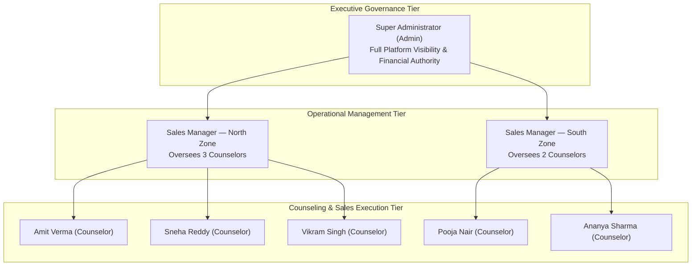

# User Requirements & Role Hierarchy Specification (URS)
## Career Apex CRM — Student Placement & Career Counseling Sales CRM

---

### Document Control
- **Document Identifier:** URS-APEX-02
- **Version:** 2.0
- **Status:** Approved
- **Audience:** Product Managers, System Architects, Security Engineers, QA Teams

---

## 1. Purpose & User Archetypes

The Career Apex CRM enforces a strict three-tier organizational hierarchy. Each role corresponds to specific operational duties, data visibility boundaries, and transactional permissions within the career counseling and student placement lifecycle.

---

## 2. Detailed User Personas & Jobs-to-be-Done (JTBD)

### 2.1 Persona 1: Super Administrator
- **Representative Profile:** Rajesh Sharma (ID: `USR-001`), Director of Placement Operations.
- **Primary Goal:** Maximize student intake, ensure team compliance, audit fee realization, and eliminate bottlenecks in placement hiring.
- **Core Frustrations:** Lack of centralized visibility into booked vs collected fees; duplicate candidate records; counselors hoarding uncontacted leads.
- **Jobs-to-be-Done (JTBD):**
  - "When reviewing monthly operations, I want to see total placement revenue contracted, cash realized, and overdue balances across all centers."
  - "When onboarding bulk college lists, I want to upload 5,000 students at once and automatically distribute them to counselors without duplicate mobile numbers."
  - "When a counselor resigns or underperforms, I want to reassign their entire candidate portfolio to another counselor with one click."

### 2.2 Persona 2: Sales Manager
- **Representative Profile:** Priya Patel (ID: `USR-002`), Regional Sales Manager (North Zone).
- **Primary Goal:** Drive team counseling targets, track daily calls/follow-ups, and monitor installment collections across direct reporting counselors.
- **Core Frustrations:** Counselors forgetting to follow up with warm prospects; milestone payments lapsing into overdue status without notice.
- **Jobs-to-be-Done (JTBD):**
  - "Every morning, I want to view my team command center to see today's pending follow-ups and overdue dues under my reporting counselors."
  - "When raw cold-calling data arrives, I want to allocate specific batches to my team members based on their target quotas."
  - "When reviewing weekly performance, I want to benchmark counselors by lead-to-conversion win rates and cash collected."

### 2.3 Persona 3: Career Counselor / Sales Representative
- **Representative Profile:** Amit Verma (ID: `USR-004`), Senior Career Counselor.
- **Primary Goal:** Rapidly connect with student job seekers, explain training and placement benefits, schedule follow-ups, agree on placement fees, and collect milestone payments.
- **Core Frustrations:** Complex CRMs that require 10 clicks to log a call; having to switch to WhatsApp Web manually; losing track of student installment due dates.
- **Jobs-to-be-Done (JTBD):**
  - "When I log in, I want an immediate action queue showing exactly which students I need to call today and which follow-ups are overdue."
  - "When viewing my Cold Calling sheet, I want to click one button to trigger a call or open a pre-filled WhatsApp message without navigating away."
  - "When a student pays an installment via UPI, I want to enter the UTR reference number and instantly generate a formatted, printable receipt."

---

## 3. Data Scoping & Visibility Boundaries

The application enforces automatic data scoping at the data layer (`Customers.getScopedCustomers(user)`):

| Data Domain | Super Administrator Scope | Sales Manager Scope | Career Counselor Scope |
| :--- | :--- | :--- | :--- |
| **Student Profiles** | **Global:** All registered students in the organization. | **Team-Scoped:** Students assigned to counselors reporting to this manager. | **Personal:** Students directly assigned to this counselor's user ID. |
| **Pipeline Views** | Views all students across all stages. | Views team students across all stages. | Views personal students across all stages. |
| **Placement Fees & Payments** | Audits all revenue, collections, and overdue dues across all centers. | Monitors booked vs collected fees for own reporting team. | Tracks booked fees, collections, and dues for personal candidates. |
| **Call Logs & Follow-ups** | Global audit trail of all company communications. | All calls and scheduled follow-ups created by team counselors. | Personal scheduled calls and assigned follow-ups. |
| **Reports & Leaderboards** | Full access to all 4 reports with global multi-filters. | Team performance, team revenue, and team stage velocity. | View personal conversion benchmarks and revenue targets. |
| **User & Team Management** | Full CRUD on all managers and counselors. | View reporting team members; request reassignment. | View own user profile. |

---

## 4. Role-Based Access Control (RBAC) Matrix

| System Action / Feature | Admin (`admin`) | Sales Manager (`manager`) | Career Counselor (`sales`) |
| :--- | :---: | :---: | :---: |
| **Access Login & Session Switching** | Full | Full | Full |
| **View Executive Dashboard** | Global | Team Command Center | Personal Workspace |
| **Register New Student Candidate** | Yes | Yes | Yes |
| **Edit Student Profile (Academic/Personal)** | Yes | Yes | Yes |
| **Edit Student Placement Fee & Plan** | Yes | Yes | View / Update via Payment Record |
| **Delete Student Record** | Yes (Admin Confirmation) | No | No |
| **Move Pipeline Stage** | Yes (With reason) | Yes (With reason) | Yes (With reason) |
| **Bulk Import Leads (Excel/CSV)** | Yes (Global assign) | Yes (Team assign) | View-only |
| **Reassign Student Counselor** | Yes (Any user) | Yes (Within team) | No |
| **Record Milestone Fee Payment** | Yes | Yes | Yes (Assigned candidates) |
| **Print Official Payment Receipt** | Yes | Yes | Yes |
| **Log Telephony Call Outcome** | Yes | Yes | Yes |
| **Trigger WhatsApp Direct Outreach** | Yes | Yes | Yes |
| **Schedule / Complete Follow-up Task** | Yes | Yes | Yes |
| **Export Student Directory to CSV** | Yes | Yes | Yes (Assigned only) |
| **Export Revenue & Team Reports to CSV** | Yes | Yes | No |
| **System Settings & Reset Demo Data** | Yes | No | No |

---

## 5. User Authentication & Session Security Requirements

1. **Authentication Mode:** 
   - Prototype: Local session persistence via `crm_session` with 1-click persona switchers for rapid user testing.
   - Production Target: OAuth2 / JWT (JSON Web Tokens) with cryptographically signed bearer tokens, HTTP-only refresh cookies, and 15-minute token expiry.
2. **Session Timeout:** Automatic logout warning after 30 minutes of idle inactivity.
3. **Route Guarding:** Client-side router checks `Auth.requireAuth([allowedRoles])` before rendering any page. Unauthorized navigation immediately redirects to `index.html`.
4. **Audit Trail Association:** Every create, update, stage transition, and payment record must automatically stamp `userId`, `userName`, and `timestamp` from the active session.
