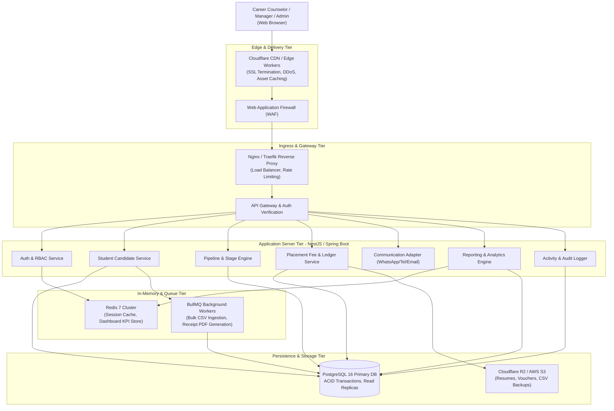
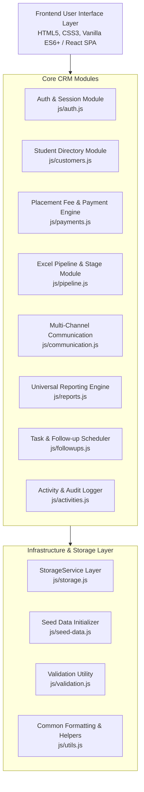
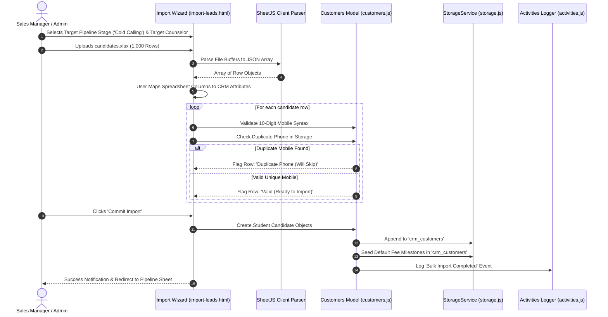
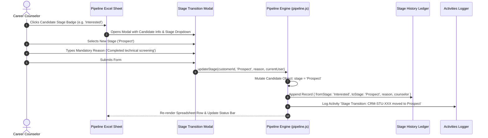

# High-Level Design Document (HLD)
## Career Apex CRM — Student Placement & Career Counseling Sales CRM

---

### Document Control
- **Document Identifier:** HLD-APEX-05
- **Version:** 2.0
- **Status:** Approved
- **Audience:** System Architects, Tech Leads, Engineering Managers, Security Officers

---

## 1. Architectural Vision & System Topology

### 1.1 Architectural Philosophy
Career Apex CRM is designed with a **Strict Layered Separation of Concerns**. The current frontend prototype operates with pure client-side persistence (`StorageService`), but its software interfaces (Data Access, Model Contracts, and Service Facades) are structured to mirror standard enterprise REST API boundaries. This guarantees that transitioning to a full-stack backend requires zero redesign of the visual UI components.

### 1.2 Enterprise Production Architecture (C4 Container Diagram)



---

## 2. Subsystem & Module Decomposition



### 2.1 Module Responsibility Matrix

| Module Name | File Path | Core Responsibilities |
| :--- | :--- | :--- |
| **Auth & Session** | `js/auth.js` | User authentication, demo persona switching, session storage, and route authorization guards. |
| **Student Directory** | `js/customers.js` | CRUD operations for student candidate files, academic qualifications, deduplication checks, and data scoping. |
| **Placement Payments** | `js/payments.js` | Agreed fee plans, milestone schedule generation, transaction ledger logging, balance calculation, and receipt generation. |
| **Pipeline & Stages** | `js/pipeline.js` | 10-stage state transitions, mandatory reason enforcement, and Excel spreadsheet view rendering. |
| **Communication** | `js/communication.js`| Telephony call logging, WhatsApp deep-link generation with templates, and email composer. |
| **Reporting & Analytics**| `js/reports.js` | Universal multi-dimensional dataset filtering, fee realization calculations, team win rate benchmarks. |
| **Follow-up Tasks** | `js/followups.js` | Task scheduling, categorization (`Overdue`, `Today`, `Upcoming`), and completion outcome capture. |
| **Activity Audit** | `js/activities.js` | Immutable chronological logging of all candidate interactions, stage transitions, and financial events. |
| **Storage Service** | `js/storage.js` | Data abstraction layer wrapping storage persistence with automated ID generation and JSON serialization. |

---

## 3. End-to-End Architectural Data Flows

### 3.1 Bulk Ingestion & Duplicate Protection Flow


### 3.2 Stage Progression with Mandatory Audit Reason


### 3.3 Fee Collection, Balance Recalculation & Receipt Issuance
```mermaid
sequenceDiagram
    autonumber
    actor Counselor as Career Counselor
    participant Details as Student Profile (customer-details.html)
    participant PayModal as Record Payment Modal
    participant PayEngine as Payments Engine (payments.js)
    participant Storage as StorageService
    participant ReceiptModal as Printable Receipt Modal

    Counselor->>Details: Clicks 'Collect Payment' on Milestone 1 (₹22,500)
    Details->>PayModal: Open Modal with Pre-filled Amount & Milestone Label
    Counselor->>PayModal: Enters Payment Mode ('UPI'), UTR Ref ('UTR-98234120'), Notes
    Counselor->>PayModal: Submits Payment
    PayModal->>PayEngine: recordPayment({ customerId, amount, mode, ref, receivedBy })
    PayEngine->>PayEngine: Generate Voucher Number ('REC-00124')
    PayEngine->>Storage: Append to 'crm_payments'
    PayEngine->>PayEngine: Update Milestone Status to 'Paid'
    PayEngine->>PayEngine: Recalculate: paidAmount += 22500, pendingAmount -= 22500
    PayEngine->>PayEngine: Update paymentStatus ('Partially Paid' or 'Fully Paid')
    PayEngine->>Storage: Update 'crm_customers'
    PayEngine->>Storage: Log Audit Activity
    PayEngine-->>Details: Render Updated Balances & Ledger Table
    PayEngine->>ReceiptModal: Render Formatted Voucher with Candidate & Payment Details
    ReceiptModal-->>Counselor: Displays Official Printable Receipt
```

---

## 4. Security & Access Control Architecture

### 4.1 Route Guarding & Client-Side Interceptors
Every page template initializes with an authentication checkpoint:
```javascript
const user = Auth.requireAuth(['admin', 'manager']);
if (!user) return; // Immediate redirect to index.html
```

### 4.2 Model-Level Data Scoping
Data visibility is enforced within the model, not merely hidden in CSS:
- Counselors calling `Customers.getScopedCustomers()` receive an array filtered strictly by `c.salespersonId === user.id`.
- Managers receive an array filtered by `c.managerId === user.id`.
- Direct ID lookups via `Customers.getById(id)` verify that the retrieved candidate belongs to the active user's authorization boundary.

### 4.3 XSS Sanitization & Data Protection
- All user-generated strings (Candidate Name, College, Skills, Notes, Reasons) pass through `Utils.escapeHtml()` before DOM injection to eliminate Cross-Site Scripting (XSS) attack vectors.
- Telephony numbers pass through strict regex sanitation (`^\d{10}$`) preventing injection payloads in communication deep-links.

---

## 5. Scalability & Performance Strategy

1. **Virtualization Strategy for Large Sheets:** When migrating to 50,000+ candidate sheets, the table renderer utilizes virtual windowing (rendering only visible rows in the viewport) to maintain sub-100ms render speeds.
2. **Asynchronous Background Ingestion:** Production backend delegates bulk Excel parsing and duplicate scanning to Redis-backed worker queues (`BullMQ`), preventing API Gateway timeouts on 100,000-row uploads.
3. **Optimistic UI Updates:** Client-side prototype updates UI immediately upon recording calls, follow-ups, and payments, writing to storage asynchronously.
