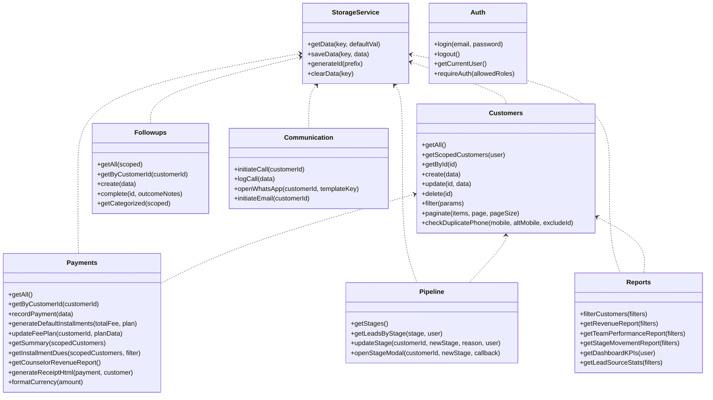
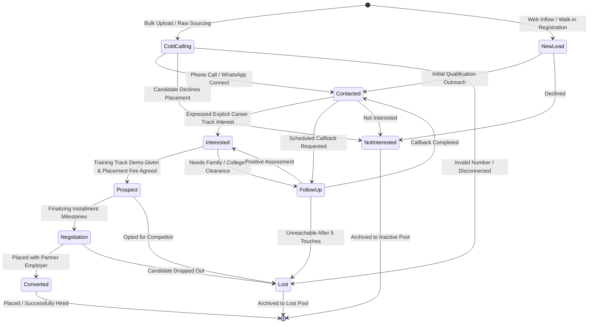
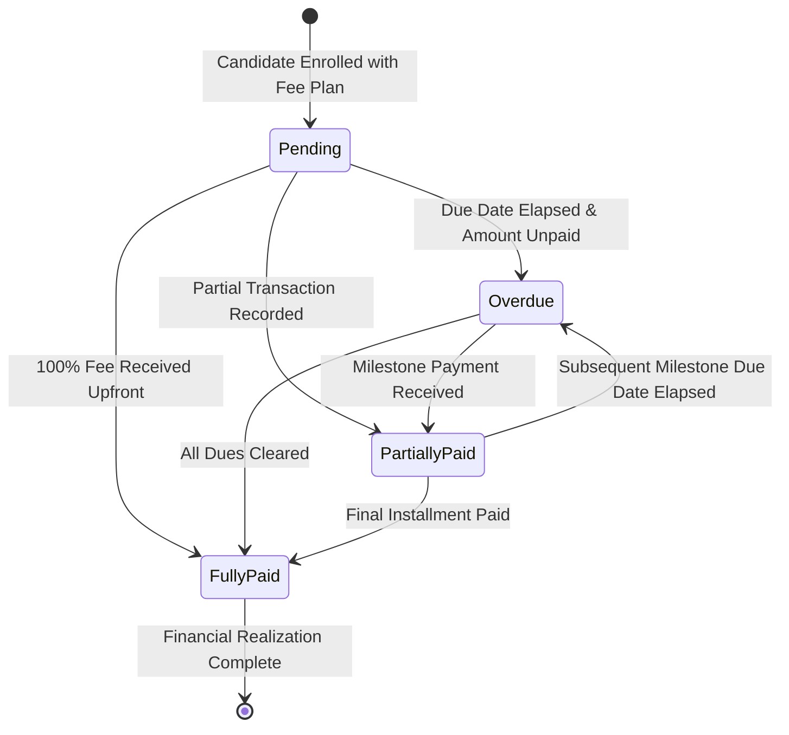

# Low-Level Design Document (LLD)
## Career Apex CRM — Student Placement & Career Counseling Sales CRM

---

### Document Control
- **Document Identifier:** LLD-APEX-06
- **Version:** 2.0
- **Status:** Approved
- **Audience:** Full-Stack Engineers, Frontend Developers, QA Automation Engineers

---

## 1. Class & Module Architecture

The application is structured into modular JavaScript classes operating under a singleton pattern, exposing predictable programmatic contracts.



---

## 2. Detailed Method Signatures & Programmatic Contracts

### 2.1 Payments Module (`js/payments.js`)

#### `Payments.recordPayment(data)`
- **Parameters:**
  ```typescript
  interface RecordPaymentPayload {
    customerId: string;
    amount: number;
    paymentMode: 'UPI' | 'Net Banking' | 'Credit/Debit Card' | 'Cash' | 'Cheque';
    transactionRef: string;
    receivedBy?: string;
    installmentId?: string;
    notes?: string;
  }
  ```
- **Returns:**
  ```typescript
  interface RecordPaymentResult {
    success: boolean;
    message?: string;
    payment?: PaymentTransactionObject;
    customer?: StudentCandidateObject;
  }
  ```
- **Operational Logic:**
  1. Validates that `amount > 0`.
  2. Retrieves customer; verifies `amount <= customer.pendingAmount`.
  3. Generates unique voucher code: `StorageService.generateId('REC')`.
  4. Appends payment record to `crm_payments`.
  5. Updates matching installment milestone status to `Paid` and records `paidDate` and `transactionRef`.
  6. Increments `customer.paidAmount` and decrements `customer.pendingAmount`.
  7. Updates `customer.paymentStatus`: sets `Fully Paid` if `pendingAmount === 0`, else `Partially Paid`.
  8. Commits customer updates to `crm_customers`.
  9. Logs audit event to `crm_activities`.

---

#### `Payments.generateDefaultInstallments(totalFee, plan)`
- **Parameters:** `totalFee: number`, `plan: string`
- **Returns:** `InstallmentMilestone[]`
- **Installment Generation Logic:**
  - `Full Payment Upfront`:
    - Milestone 1: 100% of `totalFee`, due in 7 days.
  - `2 Installments`:
    - Milestone 1 (Registration): 50% of `totalFee`, due in 7 days.
    - Milestone 2 (On Placement / Final): 50% of `totalFee`, due in 45 days.
  - `3 Installments`:
    - Milestone 1 (Registration): 40% of `totalFee`, due in 7 days.
    - Milestone 2 (Mid-Course Training): 30% of `totalFee`, due in 30 days.
    - Milestone 3 (Corporate Placement): 30% of `totalFee`, due in 60 days.
  - `4 Installments`:
    - Milestones 1 to 4: 25% each, due in 7, 30, 60, and 90 days respectively.

---

### 2.2 Customers Module (`js/customers.js`)

#### `Customers.checkDuplicatePhone(mobile, altMobile, excludeId)`
- **Parameters:** `mobile: string`, `altMobile?: string`, `excludeId?: string`
- **Returns:**
  ```typescript
  interface DuplicateCheckResult {
    isDuplicate: boolean;
    type?: 'primary' | 'alternate';
    customer?: StudentCandidateObject;
  }
  ```
- **Operational Logic:**
  Iterates through all candidates in storage. If `candidate.id !== excludeId`, compares numeric mobile strings against both `candidate.mobile` and `candidate.altMobile`.

---

#### `Customers.filter(params)`
- **Parameters:**
  ```typescript
  interface FilterParams {
    search?: string;
    stage?: string;
    status?: string;
    priority?: string;
    salespersonId?: string;
    managerId?: string;
    passingYear?: string;
    city?: string;
    paymentStatus?: 'All' | 'Fully Paid' | 'Partially Paid' | 'Pending' | 'Overdue';
  }
  ```
- **Returns:** `StudentCandidateObject[]`
- **Filtering Logic:**
  - Evaluates search keywords against ID, Name, College, Qualification, Skills, Role, Mobile, and City.
  - Applies strict filters for Stage, Status, Priority, Counselor, Manager, YOP, City.
  - **Special Overdue Evaluation:** When `paymentStatus === 'Overdue'`, checks whether any installment milestone has `(status === 'Pending' || status === 'Overdue')` and `dueDate < todayStr`.

---

## 3. Finite State Machine Specifications

### 3.1 Candidate Placement Pipeline State Machine



#### State Transition Rules Table
| Current Stage | Allowed Next Stages | Preconditions & Validation Rules | Mandatory Reason Required |
| :--- | :--- | :--- | :---: |
| `Cold Calling` | `Contacted`, `Not Interested`, `Lost` | Must log call outcome or touchpoint. | Yes |
| `New Lead` | `Contacted`, `Not Interested`, `Lost` | Outreach touchpoint attempted. | Yes |
| `Contacted` | `Interested`, `Follow-up`, `Not Interested`, `Lost` | Counselor recorded initial interest score. | Yes |
| `Interested` | `Prospect`, `Follow-up`, `Not Interested` | Qualification confirmed, placement terms shared. | Yes |
| `Prospect` | `Negotiation`, `Follow-up`, `Lost` | Fee plan agreed; interview preparation initiated. | Yes |
| `Negotiation` | `Converted`, `Lost` | Interview cleared; corporate offer letter released. | Yes |
| `Converted` | None (Terminal) | Student accepted offer; payment milestone completed. | Yes |

---

### 3.2 Placement Fee & Milestone Payment State Machine



---

## 4. Core Algorithms

### 4.1 Real-Time Financial Balance Calculation Algorithm
```typescript
function recalculateCustomerBalance(customerId: string): void {
  const customer = StorageService.getById('crm_customers', customerId);
  const payments = StorageService.getData('crm_payments').filter(p => p.customerId === customerId);
  
  const totalPaid = payments.reduce((sum, p) => sum + Number(p.amount), 0);
  const pending = Math.max(0, Number(customer.totalFee) - totalPaid);
  
  customer.paidAmount = totalPaid;
  customer.pendingAmount = pending;
  
  const todayStr = new Date().toISOString().split('T')[0];
  const hasOverdueMilestone = Array.isArray(customer.installments) && 
    customer.installments.some(inst => 
      inst.status !== 'Paid' && inst.dueDate && inst.dueDate < todayStr
    );

  if (pending === 0 && customer.totalFee > 0) {
    customer.paymentStatus = 'Fully Paid';
  } else if (hasOverdueMilestone) {
    customer.paymentStatus = 'Overdue';
  } else if (totalPaid > 0) {
    customer.paymentStatus = 'Partially Paid';
  } else {
    customer.paymentStatus = 'Pending';
  }

  StorageService.update('crm_customers', customerId, customer);
}
```

### 4.2 Auto Round-Robin Lead Allocation Algorithm
```typescript
function allocateLeadsRoundRobin(leads: RawLeadInput[], counselors: User[]): AssignedLead[] {
  if (!counselors.length) throw new Error("No active counselors available for assignment.");
  
  let currentIndex = 0;
  return leads.map(lead => {
    const counselor = counselors[currentIndex % counselors.length];
    currentIndex++;
    return {
      ...lead,
      salespersonId: counselor.id,
      salespersonName: counselor.name,
      managerId: counselor.managerId || null,
      managerName: counselor.managerName || null
    };
  });
}
```
