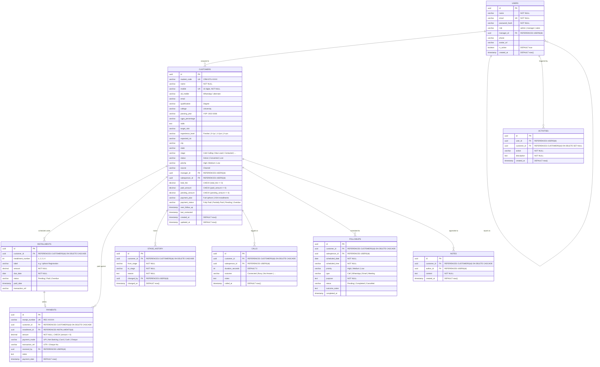

# Database Design & Data Dictionary
## Career Apex CRM — Student Placement & Career Counseling Sales CRM

---

### Document Control
- **Document Identifier:** DB-APEX-07
- **Version:** 2.0
- **Status:** Approved
- **Target Database Engine:** PostgreSQL 16 Enterprise (ACID compliant)

---

## 1. Entity-Relationship Diagram (ERD)



---

## 2. Production PostgreSQL DDL Scripts

```sql
-- 1. USERS & ROLES TABLE
CREATE TABLE users (
    id UUID PRIMARY KEY DEFAULT gen_random_uuid(),
    name VARCHAR(150) NOT NULL,
    email VARCHAR(255) UNIQUE NOT NULL,
    password_hash VARCHAR(255) NOT NULL,
    role VARCHAR(30) NOT NULL CHECK (role IN ('admin', 'manager', 'sales')),
    manager_id UUID REFERENCES users(id) ON DELETE SET NULL,
    phone VARCHAR(20),
    avatar_url TEXT,
    is_active BOOLEAN DEFAULT TRUE,
    created_at TIMESTAMP WITH TIME ZONE DEFAULT CURRENT_TIMESTAMP
);

-- 2. CANDIDATE JOB SEEKERS TABLE
CREATE TABLE customers (
    id UUID PRIMARY KEY DEFAULT gen_random_uuid(),
    student_code VARCHAR(30) UNIQUE NOT NULL,
    name VARCHAR(150) NOT NULL,
    mobile VARCHAR(15) UNIQUE NOT NULL,
    alt_mobile VARCHAR(15),
    email VARCHAR(255),
    qualification VARCHAR(100),
    college VARCHAR(255),
    passing_year VARCHAR(10),
    cgpa_percentage VARCHAR(20),
    skills TEXT,
    target_role VARCHAR(100),
    experience_level VARCHAR(30) DEFAULT 'Fresher',
    expected_ctc VARCHAR(50),
    city VARCHAR(100),
    state VARCHAR(100),
    stage VARCHAR(50) NOT NULL DEFAULT 'Cold Calling',
    status VARCHAR(50) NOT NULL DEFAULT 'Active',
    priority VARCHAR(20) NOT NULL DEFAULT 'Medium' CHECK (priority IN ('High', 'Medium', 'Low')),
    source VARCHAR(100) DEFAULT 'Website Inquiry',
    manager_id UUID REFERENCES users(id) ON DELETE SET NULL,
    salesperson_id UUID REFERENCES users(id) ON DELETE SET NULL,
    total_fee DECIMAL(12,2) NOT NULL DEFAULT 45000.00 CHECK (total_fee >= 0),
    paid_amount DECIMAL(12,2) NOT NULL DEFAULT 0.00 CHECK (paid_amount >= 0),
    pending_amount DECIMAL(12,2) NOT NULL DEFAULT 45000.00 CHECK (pending_amount >= 0),
    payment_plan VARCHAR(50) DEFAULT '2 Installments',
    payment_status VARCHAR(30) DEFAULT 'Pending' CHECK (payment_status IN ('Fully Paid', 'Partially Paid', 'Pending', 'Overdue')),
    next_follow_up TIMESTAMP WITH TIME ZONE,
    last_contacted TIMESTAMP WITH TIME ZONE,
    created_at TIMESTAMP WITH TIME ZONE DEFAULT CURRENT_TIMESTAMP,
    updated_at TIMESTAMP WITH TIME ZONE DEFAULT CURRENT_TIMESTAMP
);

-- 3. INSTALLMENT MILESTONES TABLE
CREATE TABLE installments (
    id UUID PRIMARY KEY DEFAULT gen_random_uuid(),
    customer_id UUID NOT NULL REFERENCES customers(id) ON DELETE CASCADE,
    installment_number INT NOT NULL,
    label VARCHAR(100) NOT NULL,
    amount DECIMAL(12,2) NOT NULL CHECK (amount > 0),
    due_date DATE NOT NULL,
    status VARCHAR(30) DEFAULT 'Pending' CHECK (status IN ('Pending', 'Paid', 'Overdue')),
    paid_date TIMESTAMP WITH TIME ZONE,
    transaction_ref VARCHAR(100)
);

-- 4. FINANCIAL PAYMENT TRANSACTIONS TABLE
CREATE TABLE payments (
    id UUID PRIMARY KEY DEFAULT gen_random_uuid(),
    receipt_number VARCHAR(50) UNIQUE NOT NULL,
    customer_id UUID NOT NULL REFERENCES customers(id) ON DELETE CASCADE,
    installment_id UUID REFERENCES installments(id) ON DELETE SET NULL,
    amount DECIMAL(12,2) NOT NULL CHECK (amount > 0),
    payment_mode VARCHAR(50) NOT NULL CHECK (payment_mode IN ('UPI', 'Net Banking', 'Credit/Debit Card', 'Cash', 'Cheque')),
    transaction_ref VARCHAR(100) NOT NULL,
    received_by UUID REFERENCES users(id) ON DELETE SET NULL,
    notes TEXT,
    payment_date TIMESTAMP WITH TIME ZONE DEFAULT CURRENT_TIMESTAMP
);

-- 5. STAGE TRANSITION AUDIT HISTORY
CREATE TABLE stage_history (
    id UUID PRIMARY KEY DEFAULT gen_random_uuid(),
    customer_id UUID NOT NULL REFERENCES customers(id) ON DELETE CASCADE,
    from_stage VARCHAR(50) NOT NULL,
    to_stage VARCHAR(50) NOT NULL,
    reason TEXT NOT NULL,
    changed_by UUID REFERENCES users(id) ON DELETE SET NULL,
    changed_at TIMESTAMP WITH TIME ZONE DEFAULT CURRENT_TIMESTAMP
);

-- 6. TELEPHONY CALL LOGS
CREATE TABLE calls (
    id UUID PRIMARY KEY DEFAULT gen_random_uuid(),
    customer_id UUID NOT NULL REFERENCES customers(id) ON DELETE CASCADE,
    salesperson_id UUID REFERENCES users(id) ON DELETE SET NULL,
    duration_seconds INT DEFAULT 0,
    outcome VARCHAR(100) NOT NULL,
    notes TEXT,
    called_at TIMESTAMP WITH TIME ZONE DEFAULT CURRENT_TIMESTAMP
);

-- 7. FOLLOW-UP TASKS
CREATE TABLE followups (
    id UUID PRIMARY KEY DEFAULT gen_random_uuid(),
    customer_id UUID NOT NULL REFERENCES customers(id) ON DELETE CASCADE,
    salesperson_id UUID REFERENCES users(id) ON DELETE SET NULL,
    scheduled_date DATE NOT NULL,
    scheduled_time VARCHAR(20) NOT NULL,
    priority VARCHAR(20) NOT NULL DEFAULT 'Medium',
    type VARCHAR(50) NOT NULL DEFAULT 'Call',
    purpose TEXT NOT NULL,
    status VARCHAR(30) NOT NULL DEFAULT 'Pending' CHECK (status IN ('Pending', 'Completed', 'Cancelled')),
    outcome_notes TEXT,
    completed_at TIMESTAMP WITH TIME ZONE
);

-- 8. COUNSELING NOTES
CREATE TABLE notes (
    id UUID PRIMARY KEY DEFAULT gen_random_uuid(),
    customer_id UUID NOT NULL REFERENCES customers(id) ON DELETE CASCADE,
    author_id UUID REFERENCES users(id) ON DELETE SET NULL,
    content TEXT NOT NULL,
    created_at TIMESTAMP WITH TIME ZONE DEFAULT CURRENT_TIMESTAMP
);

-- 9. AUDIT ACTIVITIES LOG
CREATE TABLE activities (
    id UUID PRIMARY KEY DEFAULT gen_random_uuid(),
    user_id UUID REFERENCES users(id) ON DELETE SET NULL,
    customer_id UUID REFERENCES customers(id) ON DELETE SET NULL,
    action VARCHAR(100) NOT NULL,
    description TEXT NOT NULL,
    created_at TIMESTAMP WITH TIME ZONE DEFAULT CURRENT_TIMESTAMP
);
```

---

## 3. Indexing & Query Optimization Strategy

```sql
-- 1. Index on Candidate Lookups
CREATE INDEX idx_customers_salesperson ON customers(salesperson_id);
CREATE INDEX idx_customers_manager ON customers(manager_id);
CREATE INDEX idx_customers_stage ON customers(stage);
CREATE INDEX idx_customers_payment_status ON customers(payment_status);
CREATE INDEX idx_customers_passing_year ON customers(passing_year);
CREATE INDEX idx_customers_created_at ON customers(created_at);

-- 2. Composite Index for Excel Sheet Filtering
CREATE INDEX idx_customers_excel_composite ON customers(salesperson_id, stage, passing_year, payment_status);

-- 3. Financial Indexes
CREATE INDEX idx_payments_customer ON payments(customer_id);
CREATE INDEX idx_installments_due_date ON installments(due_date, status);

-- 4. Follow-up Index for Dashboard Alerts
CREATE INDEX idx_followups_schedule ON followups(salesperson_id, scheduled_date, status);
```
