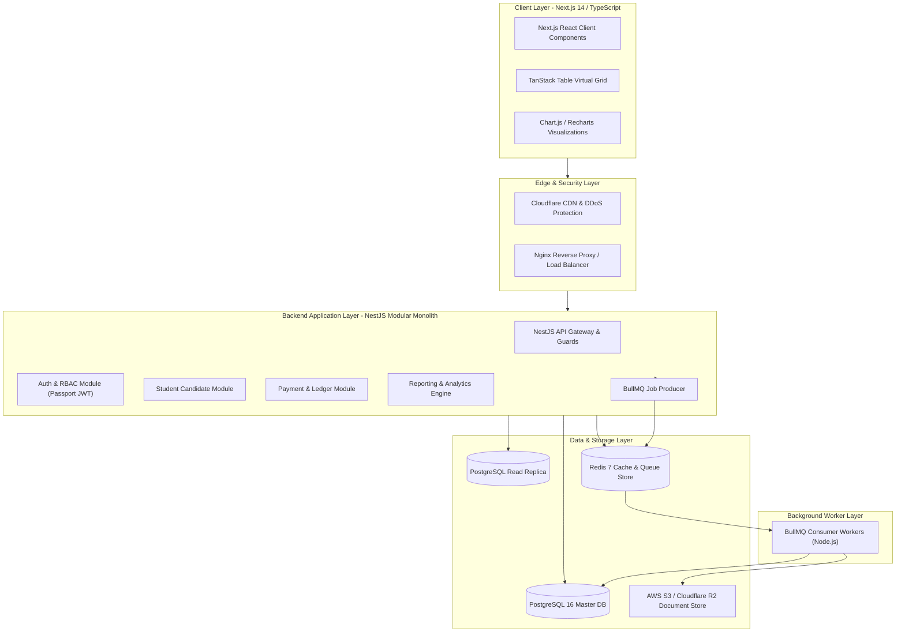
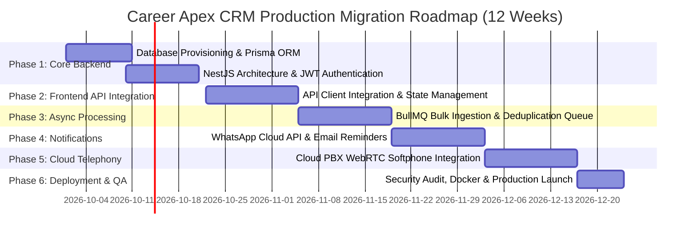

# Technology Stack & Production Migration Roadmap
## Career Apex CRM — Student Placement & Career Counseling Sales CRM

---

### Document Control
- **Document Identifier:** TECH-APEX-09
- **Version:** 2.0
- **Status:** Approved
- **Audience:** CTO, Tech Leads, DevOps Engineers, Full-Stack Developers

---

## 1. Current Prototype vs. Production Technology Comparison

| Dimension | Current Prototype Architecture | Target Enterprise Production Stack | Strategic Rationale |
| :--- | :--- | :--- | :--- |
| **Frontend Framework** | Pure HTML5, Modular Vanilla JS (ES6+), CSS3 | **Next.js 14 (App Router) + React 18 + TypeScript** | Component reusability, strict compile-time typing, server-side rendering for reports. |
| **Table Virtualization** | Custom Vanilla DOM Pagination | **TanStack Table v8 (Virtualizer)** | Enables scrolling through 50,000+ candidates without DOM memory exhaustion. |
| **Styling & Design System** | Custom Vanilla CSS with CSS Variables | **Tailwind CSS + Headless UI** | Rapid component styling preserving custom CSS token hierarchy. |
| **Backend API Engine** | Client-Side In-Memory Controllers | **Node.js (NestJS Framework) with TypeScript** | Enterprise modular architecture, dependency injection, built-in validation pipes. |
| **Database Persistence** | Browser `localStorage` (JSON-serialized) | **PostgreSQL 16 Enterprise** | ACID financial guarantees for payment ledgers, relational integrity, row-level security. |
| **Cache & In-Memory Store**| In-memory JS variables | **Redis 7 Cluster** | Distributed session storage, API rate-limiting, and dashboard KPI caching. |
| **Background Job Queues** | Synchronous client execution | **BullMQ + Redis Workers** | Asynchronous bulk CSV ingestion without blocking HTTP request threads. |
| **Document Storage** | Base64 client strings | **Cloudflare R2 / AWS S3** | Secure storage for student resumes, identity proof, and PDF voucher receipts. |
| **Telephony Integration** | `tel:` URI Scheme | **Exotel / Knowlarity / Twilio Cloud CTI** | In-browser WebRTC softphone, automatic call recording, and exact duration logging. |

---

## 2. Production Technology Stack Architecture

---

## 3. Six-Phase Migration Roadmap (Prototype to Production)

### Phase 1: Database Provisioning & NestJS API Foundation (Weeks 1–3)
- Provision managed PostgreSQL 16 cluster on AWS RDS / Supabase Enterprise.
- Execute SQL migrations for `users`, `customers`, `installments`, `payments`, `stage_history`, `calls`, `followups`, `notes`, and `activities`.
- Setup NestJS project structure with Prisma ORM.
- Implement JWT authentication with access/refresh tokens and RBAC middleware.

### Phase 2: Frontend API Client Integration (Weeks 4–5)
- Create `api-client.ts` Axios adapter with request/response interceptors and automatic token refresh.
- Swap out `StorageService` calls with asynchronous REST endpoint calls.
- Maintain existing HTML5/CSS design system so visual components remain completely untouched.

### Phase 3: High-Scale Bulk Processing & Worker Queues (Weeks 6–7)
- Configure Redis 7 cluster and initialize `BullMQ` worker pipeline.
- Implement background chunked ingestion for 100,000-row Excel spreadsheets.
- Add background duplicate phone scanning and counselor round-robin auto-distribution.

### Phase 4: Production Notification Engine (Weeks 8–9)
- Integrate Meta WhatsApp Cloud API for automated candidate notifications (welcome message, fee reminders, interview schedule confirmations).
- Integrate AWS SES / SendGrid for transactional email dispatches.
- Implement Web Push Notifications for counselor follow-up alerts.

### Phase 5: Cloud PBX Telephony Integration (Weeks 10–11)
- Integrate Exotel / Twilio WebRTC softphone inside the CRM layout.
- Implement automatic call duration tracking and secure S3 call recording storage.

### Phase 6: QA, Penetration Testing & Production Deployment (Week 12)
- Docker containerization with multi-stage build optimization.
- GitHub Actions CI/CD pipeline targeting AWS ECS / Kubernetes.
- Vulnerability scanning, penetration testing, and load testing up to 10,000 concurrent requests.
