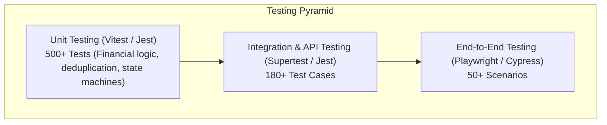
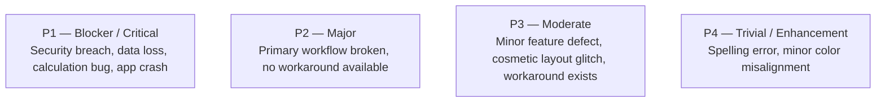

# Career Apex CRM — Comprehensive Test Plan & Acceptance Test Cases (ATP/QA)

**Document Reference:** `SDLC-DOC-010`  
**Version:** 1.0.0  
**Status:** Approved for QA Execution  
**Project:** Career Apex CRM (Student Job-Seeker Placement Platform)  
**Target Environment:** Staging / Production Pre-Flight  

---

## 1. Executive Summary & Objectives

The purpose of this Test Plan is to define the testing strategy, test coverage, test environments, acceptance criteria, and specific executable test cases for the **Career Apex CRM** web application.

The primary objective is to guarantee:
1. Zero data leakage across role boundaries (strict RBAC enforcement).
2. 100% financial accuracy in placement fee, paid amount, and outstanding installment calculations.
3. High-throughput lead ingestion with zero duplicate candidate generation.
4. Seamless real-time updates across the Excel spreadsheet pipeline and management analytics dashboards.

---

## 2. Testing Scope & Methodology

### 2.1 In-Scope Functional Areas
- Authentication, Session Management & Role-Based Navigation Guards.
- Student Candidate Management (CRUD, education history, technical skills, YOP).
- Placement Fee Ledger (Total committed fee, multi-stage installment scheduling, payment recording, balance auto-recalculation).
- Excel Spreadsheet Pipeline View (Sticky columns/headers, quick stage switcher, mandatory disqualification/drop reason capture).
- Bulk Lead Ingestion (CSV/Excel parsing, cold-lead pipeline assignment, counselor round-robin allocation).
- Omnichannel Communications (WebRTC/Twilio click-to-call, WhatsApp deep-linking, mailto composition, call outcome logging).
- Follow-up Management (Scheduling, due date alerts, overdue status flags).
- Multi-Filter Analytics & Management Reporting (Date range, counselor, qualification, and stage cross-filtering).

### 2.2 Out-of-Scope (Deferred to Phase 2)
- Direct bank payment gateway reconciliation (Razorpay/Stripe automated webhooks).
- Native mobile application builds (iOS / Android wrappers).
- Automatic AI resume parsing from PDF/DOCX uploads.

---

## 3. Testing Levels & Strategy

| Level | Tooling | Focus | Target Coverage |
| :--- | :--- | :--- | :--- |
| **Unit Testing** | Vitest / Jest | Pure functions, financial balance math, phone deduplication regex, pipeline state machines | > 90% Statement Coverage |
| **Integration Testing**| Supertest, Testcontainers (PostgreSQL) | REST API endpoints, JWT token guards, DB constraints, transactional rollback | > 85% API Endpoint Coverage |
| **End-to-End (E2E)** | Playwright | Full browser user journeys across Admin, Manager, and Counselor personas | 100% Core Workflow Coverage |
| **Performance / Load**| k6 | Bulk lead upload (50,000 rows), pipeline rendering (10,000 active students) | P95 latency < 500ms |
| **Security / Pen-Test**| OWASP ZAP, SonarQube | SQL injection, XSS sanitization, Broken Object-Level Authorization (BOLA) | Zero High/Critical Vulnerabilities |

---

## 4. Test Environment & Test Data Setup

### 4.1 Environments
- **Local Dev**: Mocked `localStorage` / SQLite in-memory, hot-reload dev server.
- **Staging / QA**: Dockerized Next.js frontend, NestJS backend API, PostgreSQL 16 container, Redis 7 cache.
- **Mock Services**: Twilio sandbox voice endpoints, MailHog SMTP server for test transactional emails.

### 4.2 Seed Test Data Personas
- **Admin**: `admin@careerapex.com` / `AdminPass@2026`
- **Sales Manager**: `manager@careerapex.com` / `ManagerPass@2026`
- **Counselor 1 (Counselor A)**: `sarah.j@careerapex.com` (assigned 50 candidates)
- **Counselor 2 (Counselor B)**: `david.k@careerapex.com` (assigned 50 candidates)
- **Counselor 3 (Counselor C)**: `priya.s@careerapex.com` (assigned 0 candidates)

---

## 5. Master Acceptance Test Matrix

### Module 1: Authentication & Scoped Route Guards

| Test ID | Scenario | Pre-Conditions | Action Steps | Expected Result | Priority |
| :--- | :--- | :--- | :--- | :--- | :--- |
| **TC-01** | Valid Counselor Login | User exists in DB with role `counselor` | 1. Navigate to `/index.html` 2. Select Counselor role 3. Enter credentials 4. Click Login | Redirected to `/pages/salesperson-dashboard.html`. JWT token stored in secure cookie. | P1 |
| **TC-02** | Valid Manager Login | User exists in DB with role `sales_manager` | 1. Select Manager role 2. Enter valid credentials 3. Click Login | Redirected to `/pages/manager-dashboard.html`. Team oversight metrics displayed. | P1 |
| **TC-03** | Valid Admin Login | User exists in DB with role `admin` | 1. Select Admin role 2. Enter credentials 3. Click Login | Redirected to `/pages/admin-dashboard.html`. Full system navigation visible. | P1 |
| **TC-04** | Invalid Password Attempt | User exists | 1. Enter correct email, wrong password 2. Click Login | Red error banner displayed: "Invalid credentials". Session not created. | P2 |
| **TC-05** | Unauthorized Route Access (Guard) | Logged in as Counselor | Attempt to navigate directly to `/pages/admin-dashboard.html` or `/pages/team.html` | Intercepted by route guard; redirected to `/pages/salesperson-dashboard.html` with warning toast "Access Denied". | P1 |

---

### Module 2: Student Candidate Registration & Deduplication

| Test ID | Scenario | Pre-Conditions | Action Steps | Expected Result | Priority |
| :--- | :--- | :--- | :--- | :--- | :--- |
| **TC-06** | Create New Candidate (Complete) | Logged in as Counselor | 1. Navigate to Students page 2. Click "+ Add Student" 3. Enter Name, Email, 10-digit Phone, Degree (B.Tech CS), YOP (2025), Skills (Java, React) 4. Set Stage to "New Lead" 5. Click Save | Candidate created with unique ID. Appears at top of Students table. Toast confirms creation. | P1 |
| **TC-07** | Phone Number Deduplication Block | Candidate with phone `9876543210` exists | 1. Open "+ Add Student" 2. Enter different name/email, but same phone `9876543210` 3. Click Save | Form validation stops submission. Alert shows: "Candidate with this phone number already assigned to Sarah Jenkins". | P1 |
| **TC-08** | Phone Format Sanitization | Logged in | 1. Input phone as `+91 (987) 654-3210` 2. Submit form | System strips special characters, normalizes to E.164 standard `+919876543210`, passes validation. | P2 |
| **TC-09** | Mandatory Field Validation | Logged in | 1. Click "+ Add Student" 2. Leave Name and Phone blank 3. Click Save | Input fields highlighted in red. Tooltips show "Full name and valid mobile number are required". Form does not submit. | P2 |
| **TC-10** | Edit Student Candidate Profile | Candidate exists | 1. Open Student Details 2. Click "Edit Profile" 3. Modify Degree to "MCA", Experience to "1 Year" 4. Click Save Changes | Details updated instantly in DB and UI. System activity logged: "Profile updated by Counselor A". | P2 |

---

### Module 3: Placement Fee & Milestone Payment Ledger

| Test ID | Scenario | Pre-Conditions | Action Steps | Expected Result | Priority |
| :--- | :--- | :--- | :--- | :--- | :--- |
| **TC-11** | Initialize Placement Package | Candidate created with no financial agreement | 1. Open Student Details > Payment tab 2. Set Total Package Fee: ₹45,000 3. Plan: 3 Installments 4. Save agreement | Financial banner updates: Total Fee = ₹45,000, Paid = ₹0, Pending = ₹45,000. Payment Status = "Unpaid". | P1 |
| **TC-12** | Record Partial Payment (Installment 1) | Package Fee = ₹45,000 | 1. Click "+ Record Payment" 2. Enter Amount: ₹15,000 3. Mode: UPI, Ref: `UPI-982348` 4. Click Submit | Ledger adds ₹15,000 row. Paid Amount = ₹15,000, Balance = ₹30,000. Status updates to "Partial Paid". Activity logged. | P1 |
| **TC-13** | Payment Exceeding Balance Block | Balance = ₹30,000 | 1. Click "+ Record Payment" 2. Enter Amount: ₹35,000 3. Click Submit | System raises error: "Payment amount (₹35,000) cannot exceed outstanding balance (₹30,000)". Form blocked. | P2 |
| **TC-14** | Complete Full Payment (Settlement) | Balance = ₹30,000 | 1. Record payment of ₹30,000 2. Mode: Net Banking | Paid = ₹45,000, Balance = ₹0. Status badge switches to emerald green "Paid". Invoice download enabled. | P1 |
| **TC-15** | Overdue Installment Notification Flag | Student has installment due date < Today and status = "Pending" | 1. Load Follow-ups and Dashboard 2. Check overdue alerts | Student highlighted with amber warning icon: "Installment #2 Overdue by 4 days". | P2 |

---

### Module 4: Excel Spreadsheet Pipeline & Stage Transitions

| Test ID | Scenario | Pre-Conditions | Action Steps | Expected Result | Priority |
| :--- | :--- | :--- | :--- | :--- | :--- |
| **TC-16** | Excel Spreadsheet Layout Verification | 100+ students in system | 1. Navigate to `/pages/pipeline.html` 2. Verify DOM structure | Spreadsheet view displays with sticky headers, frozen checkbox and candidate columns, horizontal scroll for remaining columns. | P2 |
| **TC-17** | Stage Change: Happy Path | Student in "Cold Calling" | 1. Click stage dropdown in row 2. Change to "Connected / Interested" | Instant UI update. Toast displays: "Stage moved to Connected / Interested". Activity logged in candidate history. | P1 |
| **TC-18** | Mandatory Reason on Stage "Not Interested" | Student in "Connected" | 1. Change stage to "Not Interested" | Stage does not change immediately. Modal appears: "Reason for Drop". Options: Fee Issue, Opted Higher Studies, Invalid Contact. | P1 |
| **TC-19** | Mandatory Reason Modal Cancellation | Modal open from TC-18 | 1. Click "Cancel" on drop modal | Modal closes. Candidate stage reverts to previous stage "Connected". No state change saved. | P2 |
| **TC-20** | Mandatory Reason Form Submission | Modal open from TC-18 | 1. Select "Fee Issue" 2. Enter note: "Found ₹45k out of budget" 3. Click Confirm | Stage updates to "Not Interested". Reason badge saved and displayed in candidate profile timeline. | P1 |

---

### Module 5: Bulk Excel/CSV Lead Ingestion & Allocation

| Test ID | Scenario | Pre-Conditions | Action Steps | Expected Result | Priority |
| :--- | :--- | :--- | :--- | :--- | :--- |
| **TC-21** | Valid CSV Upload (Cold Calling Pipeline) | Manager logged in | 1. Navigate to `/pages/import-leads.html` 2. Drag & drop `leads_batch_500.csv` 3. Select Target Pipeline: "Cold Calling" 4. Select Allocation: "Round-Robin to All Counselors" 5. Click Start Import | File parses without errors. Progress bar reaches 100%. 500 leads inserted. Distributed equally (~166 per counselor). | P1 |
| **TC-22** | CSV with Missing Required Columns | File missing `phone` column | 1. Upload `invalid_columns.csv` | File rejected at preview stage. Error table highlights: "Required column 'phone' is missing in header row". | P2 |
| **TC-23** | Duplicate Phone Handling during Import | CSV contains 10 numbers already in CRM | 1. Upload CSV with duplicate numbers 2. Run import | Summary report shows: "490 Leads Imported, 10 Duplicates Skipped". Downloadable error CSV provided with row details. | P1 |
| **TC-24** | Targeted Counselor Batch Assignment | File with 100 leads | 1. Target Pipeline: "Screening" 2. Counselor: "Sarah Jenkins" 3. Import | All 100 candidates assigned exclusively to Sarah Jenkins with stage "Screening". | P2 |
| **TC-25** | Large File Ingestion Performance (5,000 rows) | Valid 5k CSV | 1. Upload 5,000 lead file 2. Monitor memory and time | Import executes in asynchronous background chunks without browser freezing. Total ingestion time < 8 seconds. | P3 |

---

### Module 6: Omnichannel Communication & Follow-up Scheduling

| Test ID | Scenario | Pre-Conditions | Action Steps | Expected Result | Priority |
| :--- | :--- | :--- | :--- | :--- | :--- |
| **TC-26** | Click-to-Call Modal & Auto-Log | Counselor logged in | 1. Open student row or profile 2. Click green phone icon | Call modal opens displaying student name and number. Call duration timer starts. Audio connects. | P2 |
| **TC-27** | Call Outcome Logging & Next Follow-up | Active call finished | 1. Hang up call 2. Select Outcome: "Busy / Callback Requested" 3. Pick Next Follow-up: Tomorrow 11:00 AM 4. Save Log | Call record saved with duration and outcome. New follow-up scheduled and visible on `/pages/followups.html`. | P1 |
| **TC-28** | WhatsApp Web Link Trigger | Valid phone number | 1. Click WhatsApp icon in candidate row | New browser tab opens with URL: `https://wa.me/919876543210?text=Hi%20...`. Activity logged: "WhatsApp conversation initiated". | P2 |
| **TC-29** | Follow-up Status Completion | Follow-up due today | 1. Navigate to `/pages/followups.html` 2. Check box "Mark as Completed" 3. Enter resolution note | Follow-up moves from "Pending" to "Completed" tab. Candidate last contacted timestamp updated. | P2 |
| **TC-30** | Overdue Follow-up Badge Calculation | Follow-up date was yesterday | 1. View Counselor Dashboard | "Overdue Follow-ups" widget counter increments by 1. Highlighted in red font. | P2 |

---

### Module 7: Universal Multi-Filter Intelligence Reports

| Test ID | Scenario | Pre-Conditions | Action Steps | Expected Result | Priority |
| :--- | :--- | :--- | :--- | :--- | :--- |
| **TC-31** | Date Range Filter Application | Manager logged in | 1. Navigate to `/pages/reports.html` 2. Select Date: "This Month" 3. Click Apply | All 4 KPI summary cards (Leads, Revenue, Conversion Rate, Placements) recalculate dynamically for the selected month. | P1 |
| **TC-32** | Counselor Breakdown Filter | Multiple counselors active | 1. Select Counselor: "David Kim" 2. Click Apply | Stage funnel chart and conversion rates update to reflect only David Kim's pipeline candidates. | P1 |
| **TC-33** | Degree / Qualification Cross-Filter | Diverse student pool | 1. Select Qualification: "B.Tech CS" 2. Select Stage: "Interview Scheduled" | Table filters to show only Computer Science students currently attending job interviews. | P2 |
| **TC-34** | Export Filtered Report to CSV | Filter applied | 1. Click "Export to CSV" button | File `career_apex_report_[timestamp].csv` downloads with exact filtered row dataset matching the current view. | P2 |
| **TC-35** | Reset All Filters | Multiple filters active | 1. Click "Reset Filters" | All filter dropdowns revert to "All", date resets to current 30-day window, KPIs and charts reload full dataset. | P2 |

---

## 6. Defect Severity & Priority Classification

### SLA for Defect Resolution:
- **P1 Blocker**: Immediate hotfix within 4 hours. QA validation required before deployment.
- **P2 Major**: Fix within 24 hours. Included in daily staging regression run.
- **P3 Moderate**: Scheduled for current sprint milestone.
- **P4 Trivial**: Backlog prioritization for UI polish cycles.

---

## 7. QA Sign-Off & Exit Criteria

The Career Apex CRM shall be certified as **Production-Ready** only when all the following quantitative criteria are satisfied:

1. **100% Execution** of all 35 Acceptance Test Cases (TC-01 through TC-35).
2. **Zero Open P1 or P2 Defects** in the issue tracking system.
3. **P3/P4 Defect Count** does not exceed 5 non-critical issues.
4. **Performance Threshold**: Pipeline sheet load time under 1.5 seconds for 5,000 active records on standard broadband.
5. **Security Clearance**: 100% pass on OWASP Top 10 automated scans with zero high/critical vulnerabilities.
6. **Formal Sign-off**: Approved by Lead QA Engineer, Solutions Architect, and Lead Product Owner.

---
*End of Test Plan & Acceptance Test Cases Document.*
